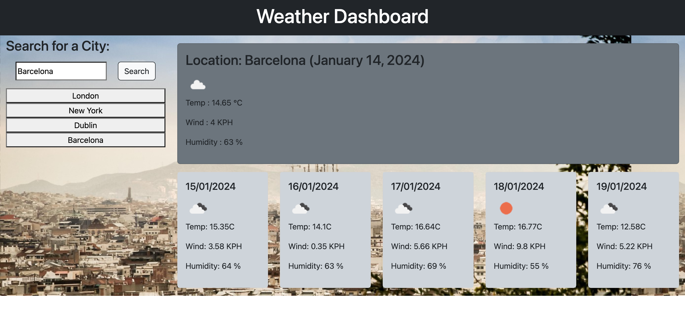

# Weather Dashboard

## Description
Weather dashboard showing the current days weather for the seached location, and 5 day forecast. 

## Usage
 
[Deployed link](https://segleston.github.io/weather-dashboard/)

- When a user searches for a city they are presented with current and future conditions for that city and that city is added to the search history
- When a user views the current weather conditions for that city they are presented with:
    - The city name
    - The date
    - An icon representation of weather conditions
    - The temperature
    - The humidity
    - The wind speed
- When a user views future weather conditions for that city they are presented with a 5-day forecast that displays:
    - The date
    - An icon representation of weather conditions
    - The temperature
    - The humidity
- When a user click on a city in the search history they are again presented with current and future conditions for that city

## Credits 
- Class TA Chris Katz
- [Weather API](https://www.openweathermap.org)
- [Background Photo API](https://pixabay.com/)
- [Jill O'Reilly](https://github.com/jilloreilly/) (Helped with styling of page)
